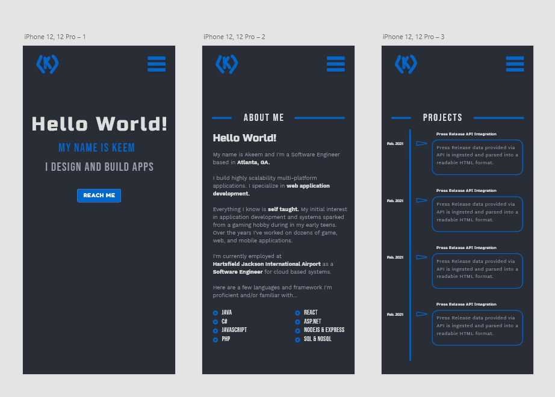
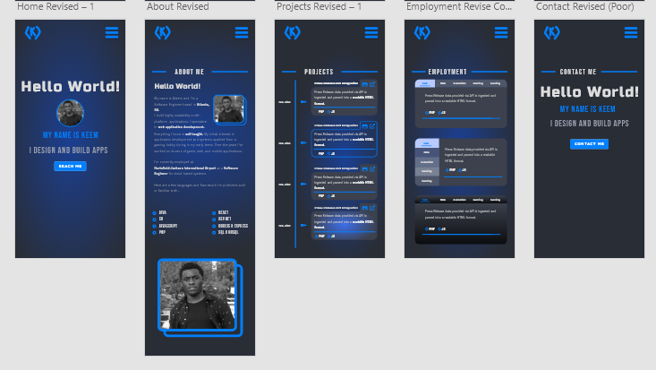

# My-Site-Redesigned

Currently still in the design phase

### What is to come? How will it function?
* Site will be designed as a Single Page App (SPA) since it'll be a portfolio site
* Site content will be implemented and displayed as an infinite scroll
* Content will be loaded into container div via an async get request from the frontend
* The next page will always be preloaded into a hidden div
* User can view the next page by scrolling down, this action will unhide and fade the rrequested page in

### First Commit Notes 11/08/2021
* As you can see I made my first commit to this today :)
* I decided I'm going to code out the initial draft of my portfolio site in basic html/css.
** After the initial draft, I'm going to be refactoring the code React

### Design

### Updated Design

