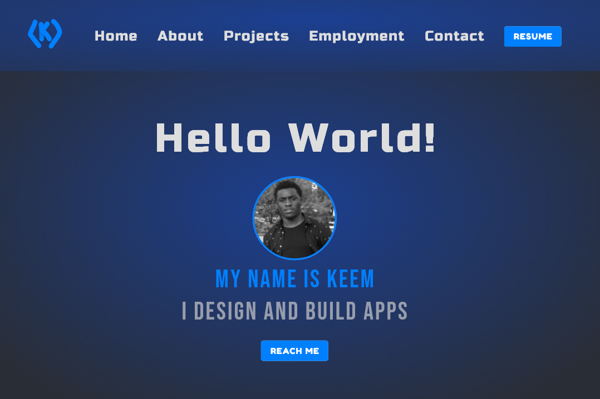

  

<h1 align="center">
  My Portfolio Site Designed
</h1>

# My-Site-Redesigned
This is the official redesign of my portfolio site [keem.div](http://keemcodes.com)

## Technology Used
* Javascript **(Frontend)**
* React **(Frontend Framework)**
* Node JS **(Backend)**
* Express **(Backend Framework)**
* MySQL + Sequelize **(Database + ORM)**

## Features
* Retrieves and loads projects data supplied via Express API
* Captures contact form data via HTTP POST to Express API

