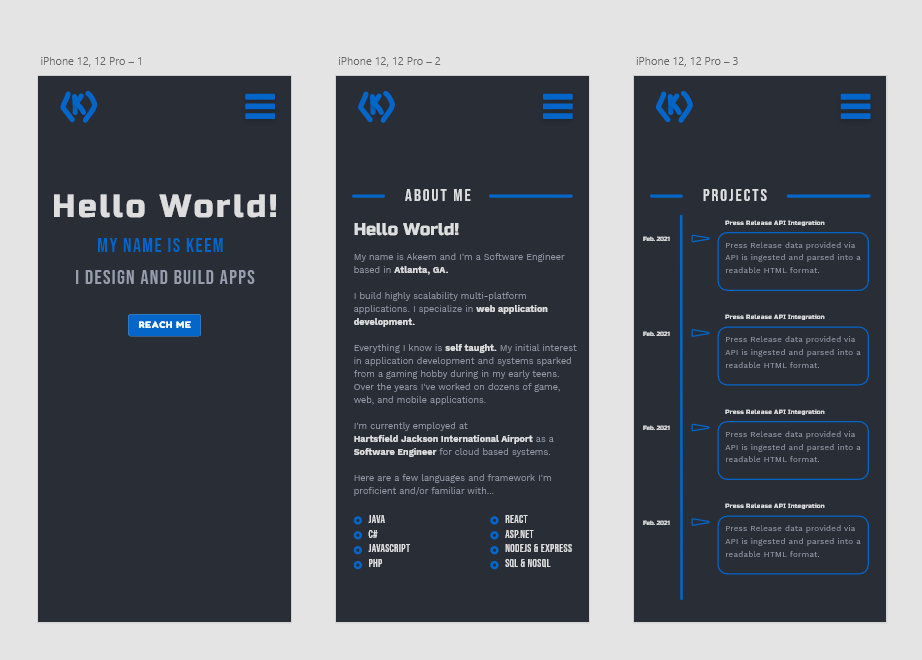

# My-Site-Redesigned

~~Currently still in the design phase~~
Currently in coding phase 11/08/2021 :)

### What is to come? How will it function?
* Site will be designed as a Single Page App (SPA) since it'll be a portfolio site
* Site content will be implemented and displayed as an infinite scroll
* Content will be loaded into container div via an async get request from the frontend
* The next page will always be preloaded into a hidden div
* User can view the next page by scrolling down, this action will unhide and fade the rrequested page in

### First Commit Notes 11/08/2021
* As you can see I made my first commit to this today :)
* I decided I'm going to code out the initial draft of my portfolio site in basic html/css.
** After the initial draft, I'm going to be refactoring the code React

### Multiple Commits Later... 11/10/2021
* Completed home and about me page (could use a little more work)
* I learned how to wrap a text block around an image using float :)
* I also messed around and learned alot about pseudo elements.
* I went ahead and deployed the [website to a server](http://keemcodes.com)
* Also, I'm developing mobile first. ill later scale the design out for desktop and tablet displays

### Bug Fixes 11/10/2021
- [x] fix issue with right margin on pseudo ::after element outstretching page width on mobile 
- [x] fix issue with certain fonts not appearing. might need to import fonts the old fashion way instead of directly into css file

## Bug Fixes 11/11/2021
- [ ] fix issue with fontawesome tab icons on iphone and firefox not appearing
- [ ] fix issue with fontawesome (remove it from codebase and use svgs instead :/)

### Design

### Updated Design

# React boilerplate readme below...

# Getting Started with Create React App

This project was bootstrapped with [Create React App](https://github.com/facebook/create-react-app).

## Available Scripts

In the project directory, you can run:

### `npm start`

Runs the app in the development mode.\
Open [http://localhost:3000](http://localhost:3000) to view it in the browser.

The page will reload if you make edits.\
You will also see any lint errors in the console.

### `npm test`

Launches the test runner in the interactive watch mode.\
See the section about [running tests](https://facebook.github.io/create-react-app/docs/running-tests) for more information.

### `npm run build`

Builds the app for production to the `build` folder.\
It correctly bundles React in production mode and optimizes the build for the best performance.

The build is minified and the filenames include the hashes.\
Your app is ready to be deployed!

See the section about [deployment](https://facebook.github.io/create-react-app/docs/deployment) for more information.

### `npm run eject`

**Note: this is a one-way operation. Once you `eject`, you can’t go back!**

If you aren’t satisfied with the build tool and configuration choices, you can `eject` at any time. This command will remove the single build dependency from your project.

Instead, it will copy all the configuration files and the transitive dependencies (webpack, Babel, ESLint, etc) right into your project so you have full control over them. All of the commands except `eject` will still work, but they will point to the copied scripts so you can tweak them. At this point you’re on your own.

You don’t have to ever use `eject`. The curated feature set is suitable for small and middle deployments, and you shouldn’t feel obligated to use this feature. However we understand that this tool wouldn’t be useful if you couldn’t customize it when you are ready for it.

## Learn More

You can learn more in the [Create React App documentation](https://facebook.github.io/create-react-app/docs/getting-started).

To learn React, check out the [React documentation](https://reactjs.org/).

### Code Splitting

This section has moved here: [https://facebook.github.io/create-react-app/docs/code-splitting](https://facebook.github.io/create-react-app/docs/code-splitting)

### Analyzing the Bundle Size

This section has moved here: [https://facebook.github.io/create-react-app/docs/analyzing-the-bundle-size](https://facebook.github.io/create-react-app/docs/analyzing-the-bundle-size)

### Making a Progressive Web App

This section has moved here: [https://facebook.github.io/create-react-app/docs/making-a-progressive-web-app](https://facebook.github.io/create-react-app/docs/making-a-progressive-web-app)

### Advanced Configuration

This section has moved here: [https://facebook.github.io/create-react-app/docs/advanced-configuration](https://facebook.github.io/create-react-app/docs/advanced-configuration)

### Deployment

This section has moved here: [https://facebook.github.io/create-react-app/docs/deployment](https://facebook.github.io/create-react-app/docs/deployment)

### `npm run build` fails to minify

This section has moved here: [https://facebook.github.io/create-react-app/docs/troubleshooting#npm-run-build-fails-to-minify](https://facebook.github.io/create-react-app/docs/troubleshooting#npm-run-build-fails-to-minify)
